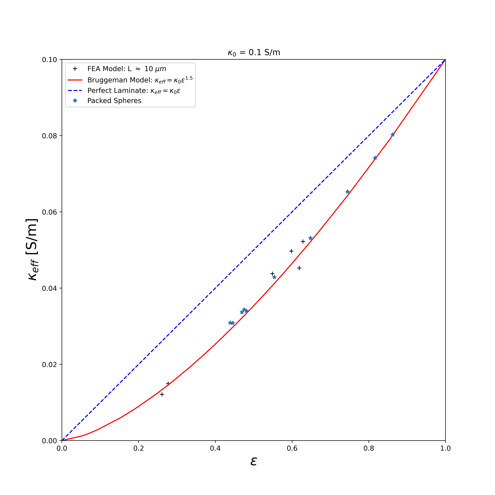

# Estimation of Effective Properties Using Finite Element Analysis
Two Python models are provided that estimate the effective conductivity and the effective active material specific area. We focus on the contact area between active material and solid electrolyte.
The [constants](constants.py) file contains constant variables such as default bulk ionic conductivity, which we set at 0.1 S/m (1 mS/cm).
For finite element analysis, we use dolfinx ([`FEniCSx`](https://github.com/FEniCS/dolfinx)). There are many installation options, but we found conda to work best for PC, e.g. in Ubuntu OS. In HPC clusters, installation via spack is preferred. We reproduce the process for installing dolfinx via conda:
```
conda create -n fenicsx-env
conda activate fenicsx-env
conda install -c conda-forge fenics-dolfinx mpich pyvista
```
In HPC clusters, installation via spack is preferred:
```
git clone https://github.com/spack/spack.git
```
Edit the file `spack/etc/spack/defaults/config.yaml` to change the temporary directory, e.g.
```
build_stage:
    - /storage/coda1/p-tf74/0/shared/user3/tmp/spack-stage
    - $user_cache_path/stage
```
```
module load gcc/10.1.0
. ./spack/share/spack/setup-env.sh
spack compiler find
spack compiler add gcc@10.1.0
spack env create fenicsx-env
spack env activate fenicsx-env
spack add py-fenics-dolfinx@0.5.1%gcc@10.1.0 cflags="-O3" fflags="-O3"
spack install
```
It may be preferrable to build gmsh without relying on the python pip installation:
```
wget https://gmsh.info/src/gmsh-4.10.5-source.tgz
tar xvzf gmsh-4-10.5-source.tgz
cd gmsh-4-10.5-source
mkdir build && cd build
cmake .. -DCMAKE_PREFIX_PATH=/storage/coda1/p-tf74/0/shared/user3/opt/ -DCMAKE_INSTALL_PREFIX=/storage/coda1/p-tf74/0/shared/user3/opt/ -DENABLE_BUILD_DYNAMIC=1
make
make install
```
You now will need to export paths to the gmsh:
```
export PYTHONPATH=$PYTHONPATH:/storage/coda1/p-tf74/0/shared/user3/opt/
export PATH=$PATH:/storage/coda1/p-tf74/0/shared/user3/opt/
```
Other required Python packages are specified in the [requirements](requirements.txt) file and can be installed via:
```
python3 -m pip install -r requirements.txt --user
```
## Geometry Preparation
The geometry used in our models is prepared from segmented tomograms. For ease of communication, we label our segmented phases as 0 for void, 1 for solid electrolyte and 2 for active material. The volume reconstruction from segmented images is achieved using the [volume_reconstruction](volume_reconstruction.py) program. The parameters are:
```
(base) molel@molel-ThinkPad-T15-Gen-2i ~/dev/ssb (dev) $ python3 volume_reconstruction.py -h
usage: volume_reconstruction.py [-h] --img_folder IMG_FOLDER --grid_info GRID_INFO [--origin ORIGIN] [--resolution [RESOLUTION]] [--phase [PHASE]] [--scale_x [SCALE_X]] [--scale_y [SCALE_Y]]
                                [--scale_z [SCALE_Z]]

Reconstructs volume from segemented images.

optional arguments:
  -h, --help            show this help message and exit
  --img_folder IMG_FOLDER
                        Directory with input .tif files
  --grid_info GRID_INFO
                        Grid size is given by Nx-Ny-Nz such that the lengths are (Nx-1) by (Ny - 1) by (Nz - 1).
  --origin ORIGIN       Where to select choice grid from available segmented image array such that `subdata = data[origin_x:Nx, origin_y:Ny, origin_z:Nz]`
  --resolution [RESOLUTION]
                        Minimum resolution using gmsh
  --phase [PHASE]       Phase that we want to reconstruct, e.g. 0 for void, 1 for solid electrolyte and 2 for active material
  --scale_x [SCALE_X]   Value to scale the Lx grid size given to match dimensions of mesh files.
  --scale_y [SCALE_Y]   Value to scale the Ly grid size given to match dimensions of mesh files.
  --scale_z [SCALE_Z]   Value to scale the Lz grid size given to match dimensions of mesh files.
```

The volume reconstruction proceeds as follows:
- Load the segmented stack of images into a 3D array
- Select coordinates of voxels that belong to phase 1 (solid electrolyte) and label them using natural numbers starting from 0
- Select coordinates of voxels that belong to phase 1 (solid electrolyte), and are neighbors to phase 2 (active material), e.g. ($$x_0$$, $$y_0$$, $$z_0$$) and ($$x_0$$, $$y_0$$ + 1, $$z_0$$) are neighbors, but  ($$x_0$$, $$y_0$$, $$z_0$$) and ($$x_0$$, $$y_0$$ + 1, $$z_0$$ + 1) are not neighbors
- Save the effective electrolyte coordinates to the file `effective_electrolyte.pickle` within the input data directory
- Create an ordered tuple of neighboring solid electrolyte voxels that form a tetrahedra such that for 8 adjacent voxels that form a cube we end up with 5 non-intersecting tetrahedra.
- Optionally refine the tetrahedra using [TetGen](https://wias-berlin.de/software/index.jsp?id=TetGen&lang=1#Introduction) with inputs points in a `.node` file and input tetrahedra in a `.ele` file
- Optionally refine the mesh further using [GMSH](https://gmsh.info/#Documentation)
- Create a tetrahedral mesh file called tetr.xdmf that is scaled to match the voxel volume size
- Using [ParaView](https://www.paraview.org/), extract the external surface of the tetrahedral mesh file&mdash;tetr.xdmf
- Label surfaces of the above surface mesh that are spanned by the coordinates of the effective electrolyte obtained in step 3, and save the triangle mesh to tria.xdmf
  NOTE: ParaView seems not to extract internal surfaces hence area is underestimated when using the surface extracted from tetrahedra mesh using ParaView
## Estimation of Effective Conductivity
This is achieved using the [transport](transport.py) model. The model input parameters are:
```
(base) molel@molel-ThinkPad-T15-Gen-2i ~/dev/ssb (dev) $ python3 transport.py -h
usage: transport.py [-h] --grid_size GRID_SIZE --data_dir DATA_DIR [--voltage [VOLTAGE]] [--scale_x [SCALE_X]] [--scale_y [SCALE_Y]] [--scale_z [SCALE_Z]] [--loglevel [LOGLEVEL]]

Estimates Effective Conductivity.

optional arguments:
  -h, --help            show this help message and exit
  --grid_size GRID_SIZE
                        Lx-Ly-Lz
  --data_dir DATA_DIR   Directory with tria.xdmf and tetr.xdmf mesh files. Output files potential.xdmf and current.xdmf will be saved here
  --voltage [VOLTAGE]   Potential to set at the left current collector. Right current collector is set to a potential of 0
  --scale_x [SCALE_X]   Value to scale the Lx grid size given to match dimensions of mesh files.
  --scale_y [SCALE_Y]   Value to scale the Ly grid size given to match dimensions of mesh files.
  --scale_z [SCALE_Z]   Value to scale the Lz grid size given to match dimensions of mesh files.
  --loglevel [LOGLEVEL]
                        Logging level, e.g. ERROR, DEBUG, INFO, WARNING
```
The output units for area and volume are assumed to be in micrometers while effective conductivity is reported in Siemens per meter.
We have validated our effective conductivity model in the following ways:
- Compare with the Bruggeman relation $\kappa_{eff} = \kappa_0\varepsilon^{1.5}$, where $\varepsilon$ is the solid electrolyte volume fraction
- Check convergence of Dirichlet boundary conditions at the two current collectors
- Check that the current on conductively isolated blocks is zero
- Check that current on the insulated surface is approximately zero
- Check that current estimated at the two current collectors are equal to within < 1%
- Check that the model reproduces effective conductivity of a perfect laminate structure where the conductor phase is fully connected along the transport direction: $\kappa_{eff} = \kappa_0\varepsilon$
- Check that the model reproduces the Bruggeman relation for random monodisperse packed spheres

[](figures/effective-conductivity.png)

## Estimation of Effective Active Material Specific Area
This is achieved using the [effective active material area](effective_active_material_area.py) model. The model input parameters are:
```
(base) molel@molel-ThinkPad-T15-Gen-2i ~/dev/ssb (dev) $ python3 effective_active_material_area.py -h
usage: effective_active_material_area.py [-h] --grid_size GRID_SIZE --data_dir DATA_DIR [--scale_x [SCALE_X]] [--scale_y [SCALE_Y]] [--scale_z [SCALE_Z]]

Estimates Effective Active Material Specific Area.

optional arguments:
  -h, --help            show this help message and exit
  --grid_size GRID_SIZE
                        Lx-Ly-Lz
  --data_dir DATA_DIR   Directory with tria.xdmf and tetr.xdmf mesh files, and effective_electrolyte.pickle file. Output files potential.xdmf and current.xdf will be saved here.
  --scale_x [SCALE_X]   Value to scale the Lx grid size given to match dimensions of mesh files.
  --scale_y [SCALE_Y]   Value to scale the Ly grid size given to match dimensions of mesh files.
  --scale_z [SCALE_Z]   Value to scale the Lz grid size given to match dimensions of mesh files.
```
The input meshfiles include two options, of which first option is preferred:
- Tetrahedral mesh of the solid electrolyte phase (tetr.xdmf) and a pickle file *effective_electrolyte.pickle* containing coordinates of solid electrolyte that are in contact with active material
- Tetrahedral mesh of the solid electrolyte phase (tetr.xdmf), and a triangle mesh of the surface of solid electrolyte (tria.xdmf) with effective active material area labelled